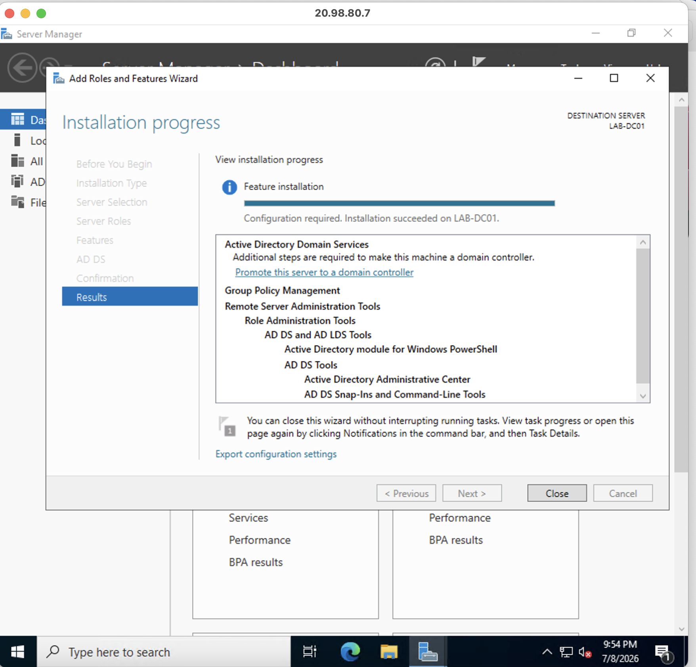
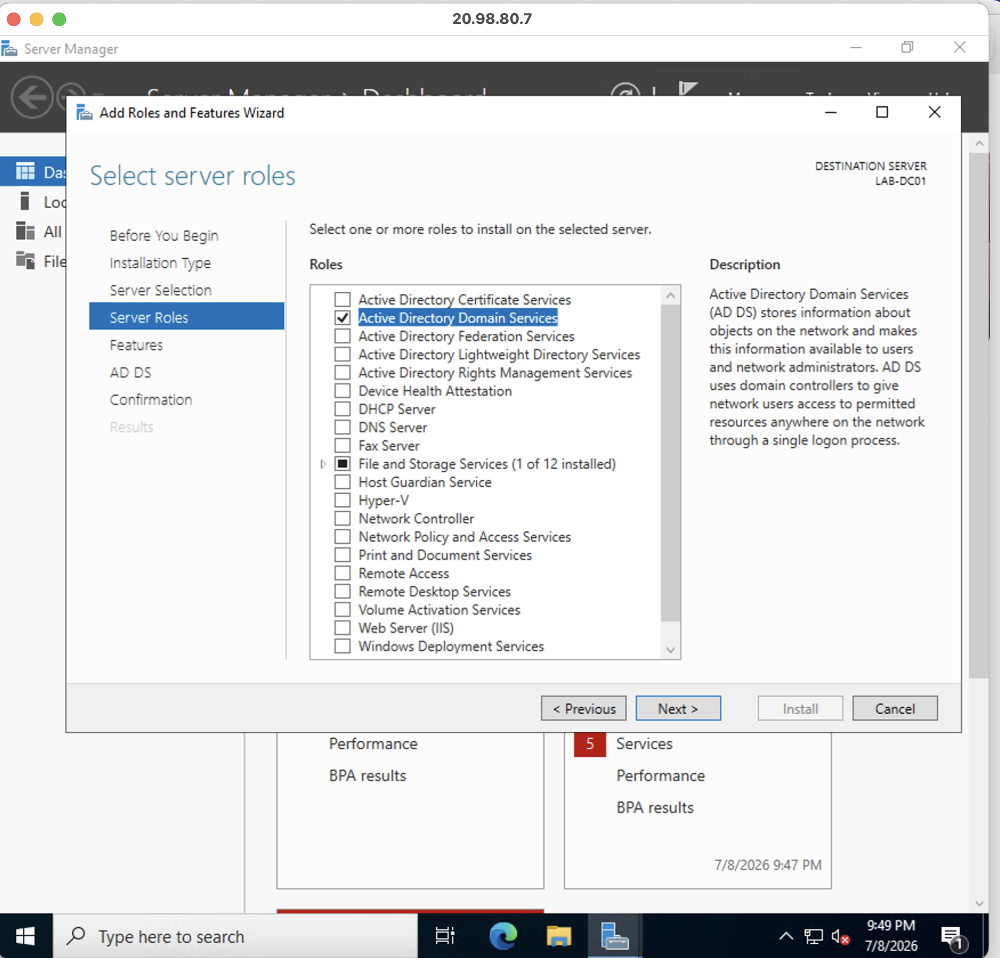

# Active Directory Domain Services (AD DS) Installation

## Business Scenario

> Organizations require centralized identity and access management to efficiently manage users, computers, authentication, and security policies. Active Directory Domain Services (AD DS) provides the directory infrastructure that allows administrators to organize and manage enterprise resources from a central location. Before creating a domain, the Windows Server must first have the AD DS server role installed and prepared for Domain Controller configuration.

---

## Project Objective

> Install the Active Directory Domain Services (AD DS) server role on the Windows Server 2022 Azure virtual machine. This prepares the server for the next phase of deployment: promoting the server to a Domain Controller and creating the Active Directory domain environment.

---

## Skills Demonstrated

* Windows Server Roles and Features Management
* Active Directory Fundamentals
* Active Directory Domain Services (AD DS)
* Server Manager Administration
* Windows Server Configuration
* Microsoft Azure Virtual Machine Administration
* Enterprise Identity Infrastructure Concepts
* Server Preparation and Validation
* Technical Documentation

---

## Screenshots

> 

> 

---

| Component        | Details                          |
| ---------------- | -------------------------------- |
| Cloud Provider   | Microsoft Azure                  |
| Server           | Windows Server 2022 Datacenter   |
| Server Name      | LABDC01                          |
| Operating System | Windows Server 2022 Datacenter   |
| Role Installed   | Active Directory Domain Services |
| Management Tool  | Server Manager                   |

---

## Project Architecture

```text
                         Microsoft Azure
                               │
                               │
                     Resource Group: Windows Lab
                               │
                               │
                 Windows Server 2022 VM (LABDC01)
                               │
                               │
                 Active Directory Domain Services
                    (Role Installed Only)
                               │
                               │
              Future Domain Controller Configuration
                               │
                               ▼
              Active Directory Forest and Domain
                    (Next Project Phase)
```

---

## Implementation Summary

### Phase 1 – Server Preparation

* Connected to the Windows Server 2022 virtual machine through Windows App.
* Verified local administrator access.
* Confirmed the server was online and ready for role installation.
* Ensured the operating system environment was prepared for Active Directory configuration.

### Phase 2 – Install Active Directory Domain Services Role

* Opened Server Manager.
* Selected **Manage → Add Roles and Features**.
* Chose **Role-based or feature-based installation**.
* Selected the local Windows Server.
* Installed the **Active Directory Domain Services** role.
* Added required supporting features when prompted.

### Phase 3 – Verify AD DS Installation

* Confirmed the AD DS role appeared in Server Manager.
* Verified the installation completed successfully.
* Confirmed the server was prepared for Domain Controller promotion.

---

## Validation

* Active Directory Domain Services role installed successfully.
* Required AD DS features installed without errors.
* Server Manager displayed Active Directory Domain Services.
* Windows Server remained operational after installation.
* Server was ready for the Domain Controller promotion process.

---

## Challenges Encountered

* Understanding the difference between installing the AD DS role and creating an Active Directory domain.
* Learning that a Windows Server does not become a Domain Controller immediately after installing AD DS.
* Ensuring the server environment was properly prepared before introducing directory services.

---

## Future Improvements

* Promote LABDC01 to a Domain Controller.
* Create the Active Directory forest and domain.
* Configure integrated DNS services.
* Design Organizational Units (OUs).
* Create users, groups, and service accounts.
* Implement Group Policy management.

---

## Related Documentation

* Microsoft Azure Windows Server Deployment
* Azure Virtual Networking Configuration
* Remote Administration with Windows App (RDP)
* Domain Controller Promotion
* DNS Configuration
