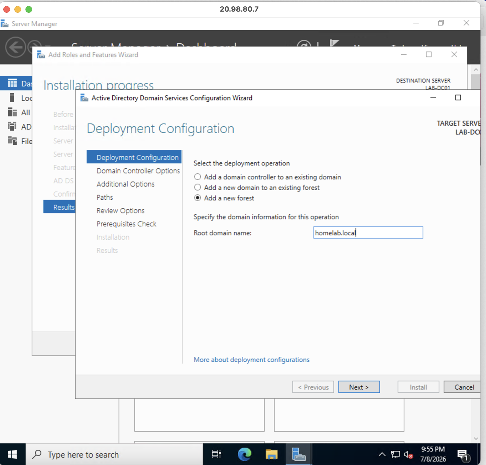

# Active Directory Domain Controller Promotion

## Business Scenario

> After installing the Active Directory Domain Services (AD DS) role, organizations must configure a server as a Domain Controller before it can provide centralized authentication and directory services. Domain Controller promotion creates the Active Directory forest and domain structure that allows administrators to manage users, computers, security groups, and enterprise resources from a centralized location.

---

## Project Objective

> Promote the Windows Server 2022 Azure virtual machine with the installed Active Directory Domain Services role into a Domain Controller. This creates the first Active Directory domain environment and enables centralized identity management for future user accounts, computers, security policies, and administrative tasks.

---

## Skills Demonstrated

* Active Directory Domain Controller Deployment
* Active Directory Forest and Domain Creation
* Windows Server Administration
* Identity and Access Management Fundamentals
* DNS Integration Concepts
* Server Role Configuration
* Domain Infrastructure Design
* Active Directory Validation
* Enterprise Troubleshooting
* Technical Documentation

---

## Screenshots

> 

> 

> 

---

| Component         | Details                                              |
| ----------------- | ---------------------------------------------------- |
| Cloud Provider    | Microsoft Azure                                      |
| Server            | Windows Server 2022 Datacenter                       |
| Server Name       | LABDC01                                              |
| Server Role       | Domain Controller                                    |
| Directory Service | Active Directory Domain Services                     |
| Management Tools  | Server Manager, Active Directory Users and Computers |
| Authentication    | Active Directory Domain Authentication               |

---

## Project Architecture

```text id="5l4z2j"
                         Microsoft Azure
                               │
                               │
                    Windows Server 2022 VM
                            LABDC01
                               │
                               │
                  Active Directory Domain Services
                               │
                               │
                  Domain Controller Promotion
                               │
                               ▼
                    Active Directory Forest
                               │
                               │
                         Domain Created
                               │
                               │
              ┌────────────────┴────────────────┐
              │                                 │
       User Authentication              Computer Management
       Security Groups                  Group Policies (Future)
       Directory Services               Domain Resources
```

---

## Implementation Summary

### Phase 1 – Begin Domain Controller Promotion

* Opened Server Manager on LABDC01.
* Selected the Server Manager notification flag.
* Started the **Promote this server to a domain controller** wizard.
* Began the Active Directory Domain Services configuration process.

### Phase 2 – Configure Active Directory Domain

* Selected the option to create a new forest.
* Configured the root domain name.
* Created the Directory Services Restore Mode (DSRM) password.
* Reviewed forest and domain configuration options.
* Confirmed domain configuration settings.

### Phase 3 – Complete Domain Controller Deployment

* Verified database, log, and SYSVOL locations.
* Reviewed final configuration settings.
* Installed the Active Directory Domain Services configuration.
* Allowed the server to restart and complete the promotion process.
* Verified the server successfully became a Domain Controller.

---

## Validation

* Server restarted successfully after promotion.
* Domain authentication options became available.
* Active Directory Users and Computers opened successfully.
* Active Directory Domains and Trusts displayed the configured domain.
* SYSVOL and NETLOGON shares were created.
* LABDC01 successfully operated as a Domain Controller.

---

## Challenges Encountered

* Understanding the relationship between AD DS installation, Domain Controller promotion, and Active Directory domain creation.
* Ensuring DNS and static IP configuration were correct before promotion.
* Troubleshooting potential domain creation issues related to networking and name resolution.
* Understanding that Domain Controllers require additional services and validation after deployment.

---

## Future Improvements

* Configure and validate DNS records.
* Create Organizational Units (OUs) based on business departments.
* Create users, security groups, and service accounts.
* Join Windows 11 client devices to the domain.
* Configure Group Policy Objects (GPOs).
* Implement Active Directory security best practices.
* Create additional administrative accounts and delegated permissions.

---

## Related Documentation

* Microsoft Azure Windows Server Deployment
* Azure Virtual Networking Configuration
* Remote Administration with Windows App (RDP)
* Active Directory Domain Services Installation
* DNS Configuration
* Organizational Unit Design
* User and Group Management
