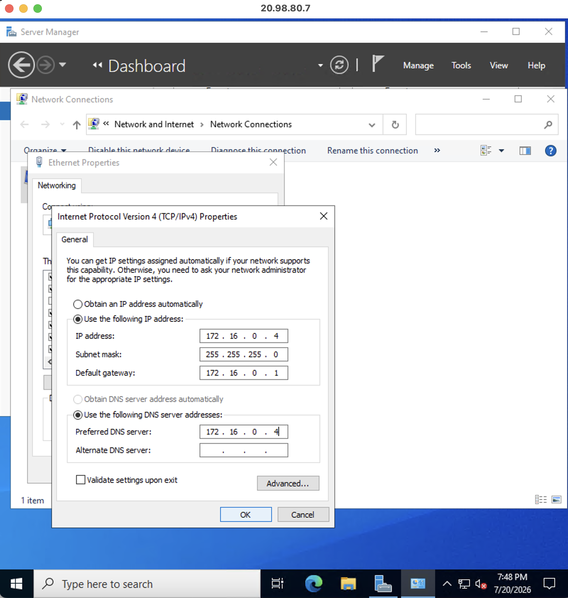

# Domain Controller Static IP Configuration

## Business Scenario

> Enterprise infrastructure servers require predictable network identities to maintain reliable communication between services. Domain Controllers, DNS servers, DHCP servers, and other core infrastructure components typically use static IP addresses because changing addresses can disrupt service discovery, authentication, and network communication. In an Active Directory environment, DNS records rely on consistent server addressing to locate Domain Controllers and related services.

---

## Project Objective

> Configure a static IPv4 address on the Domain Controller to provide a consistent network identity for Active Directory and DNS services. This ensures that LABDC01 can reliably provide authentication, DNS resolution, and domain services without relying on dynamically assigned addresses.

---

## Skills Demonstrated

* Windows Server Network Configuration
* Static IPv4 Address Assignment
* DNS Client Configuration
* Active Directory Infrastructure Requirements
* PowerShell Network Administration
* Network Troubleshooting Fundamentals
* TCP/IP Configuration
* Domain Controller Best Practices
* Infrastructure Validation

---

## Screenshots

> 

> 

---

| Component             | Details                              |
| --------------------- | ------------------------------------ |
| Cloud Provider        | Microsoft Azure                      |
| Server                | Windows Server 2022 Datacenter       |
| Server Name           | LABDC01                              |
| Role                  | Domain Controller                    |
| Network Configuration | Static IPv4 Address                  |
| IP Address            | 172.16.0.4                           |
| Subnet Mask           | 255.255.255.0                        |
| Default Gateway       | 172.16.0.1                           |
| Preferred DNS         | 172.16.0.4                           |
| Tools                 | PowerShell, Network Adapter Settings |

---

## Project Architecture

```text id="w8r3k1"
                         Microsoft Azure
                               │
                               │
                    Windows Server 2022 VM
                            LABDC01
                               │
                               │
                    Static IPv4 Configuration
                               │
          ┌────────────────────┼────────────────────┐
          │                    │                    │
          ▼                    ▼                    ▼
    172.16.0.4            DNS Server          Active Directory
     Server IP             Service              Services
          │                    │                    │
          └────────────────────┴────────────────────┘
                               │
                               ▼
                   Reliable Domain Communication
```

---

## Implementation Summary

### Phase 1 – Record Current Network Configuration

* Collected the existing network configuration before making changes.
* Used PowerShell commands:

```powershell id="m44s3f"
Get-NetIPConfiguration
```

and:

```powershell id="9pvxw4"
ipconfig /all
```

* Recorded current IP address, gateway, and DNS settings for comparison after configuration.

---

### Phase 2 – Configure Static IPv4 Address

* Opened Windows Network Adapter settings.

Steps:

1. Pressed:

```text
Windows Key + R
```

2. Entered:

```text
ncpa.cpl
```

3. Opened the Ethernet adapter properties.
4. Selected:

```text
Internet Protocol Version 4 (TCP/IPv4)
```

5. Changed the configuration from automatic addressing to manual configuration.

Configured:

| Setting         | Value         |
| --------------- | ------------- |
| IP Address      | 172.16.0.4    |
| Subnet Mask     | 255.255.255.0 |
| Default Gateway | 172.16.0.1    |

---

### Phase 3 – Configure DNS Settings

Because LABDC01 is the only Domain Controller in the environment, the server was configured to use itself as the preferred DNS server.

Configured:

| Setting              | Value      |
| -------------------- | ---------- |
| Preferred DNS Server | 172.16.0.4 |
| Alternate DNS Server | Blank      |

This allows the Domain Controller to resolve Active Directory DNS records locally.

---

## Validation

Verified the static IP configuration using PowerShell:

```powershell id="d2o8v7"
Get-NetIPInterface
```

Confirmed:

```text
InterfaceAlias   AddressFamily   Dhcp
Ethernet         IPv4            Disabled
```

Verified the assigned IPv4 address:

```powershell id="6y7s1r"
Get-NetIPAddress -AddressFamily IPv4
```

Confirmed:

* IP address was manually configured.
* DHCP was disabled.
* Address assignment was static.

Verified DNS configuration:

```powershell id="mxz7q4"
Get-DnsClientServerAddress
```

Confirmed:

* Ethernet adapter DNS points to 172.16.0.4.

Validated Active Directory and DNS health:

```powershell id="x2t9jm"
dcdiag /test:DNS
```

```powershell id="m0r7r8"
dcdiag
```

Tested DNS name resolution:

```powershell id="4g6q5p"
nslookup LABDC01
```

```powershell id="9w8m2q"
Resolve-DnsName LABDC01
```

Confirmed that DNS resolution was functioning correctly after static addressing.

---

## Challenges Encountered

### Dynamic IP Address Impact on Active Directory DNS

**Issue:**

LABDC01 was initially using a dynamically assigned IP address.

**Impact:**

* Active Directory DNS records could become inconsistent.
* DNS service discovery could fail.
* Domain authentication and service location could be affected.

**Resolution:**

Configured LABDC01 with a static IPv4 address and updated DNS settings to use the Domain Controller's own address.

---

## Useful Commands

View current network configuration:

```powershell id="g7m1b5"
Get-NetIPConfiguration
```

View full IP configuration:

```powershell id="k8z3s9"
ipconfig /all
```

Check network interface settings:

```powershell id="q4r8x2"
Get-NetIPInterface
```

View IPv4 addresses:

```powershell id="u2p6v9"
Get-NetIPAddress -AddressFamily IPv4
```

View DNS server configuration:

```powershell id="b5m9w1"
Get-DnsClientServerAddress
```

Test DNS health:

```powershell id="f8c3n7"
dcdiag /test:DNS
```

Test Domain Controller health:

```powershell id="r1k5z6"
dcdiag
```

Test DNS resolution:

```powershell id="s9v4h2"
Resolve-DnsName LABDC01
```

---

## Best Practices

* Configure static IP addresses for infrastructure servers.
* Ensure Domain Controllers use reliable internal DNS servers.
* Document network settings before making changes.
* Validate DNS functionality after network changes.
* Avoid using public DNS servers on Domain Controllers.
* Test Active Directory health after major networking changes.

---

## Future Improvements

* Document Azure network interface configuration.
* Configure additional Domain Controllers for DNS redundancy.
* Implement DHCP services for client systems.
* Create network diagrams showing Azure VNet addressing.
* Automate network validation using PowerShell.

---

## Related Documentation

* Azure Virtual Networking Configuration
* DNS Integration Verification
* Domain Controller Role Verification
* DNS Troubleshooting Scenario
* IPConfig Network Validation
* Active Directory Domain Services Deployment
