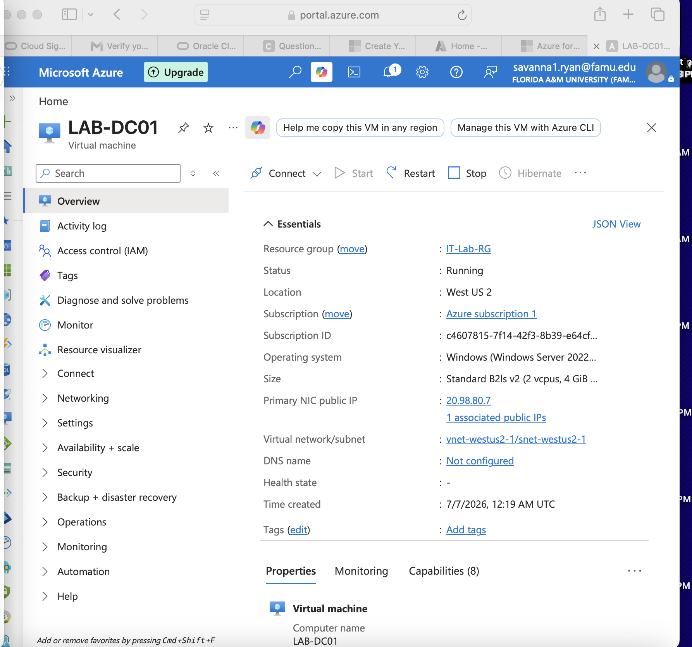
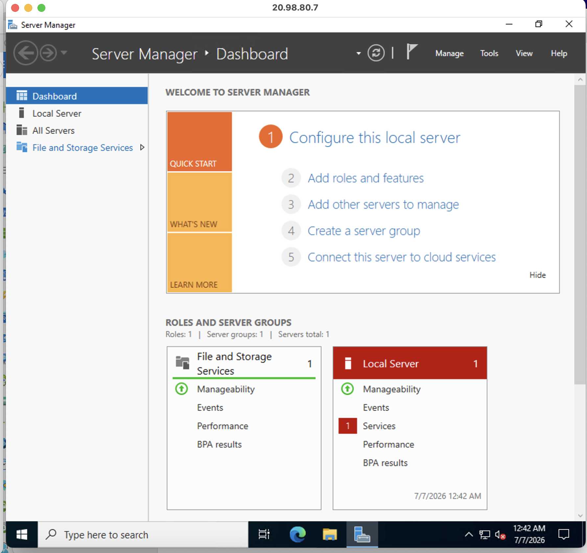

# Microsoft Azure Windows Server Deployment

## Business Scenario

> Organizations commonly host Windows Server infrastructure in cloud environments to provide scalable, highly available services without maintaining physical hardware. This project provisions a Windows Server 2022 virtual machine in Microsoft Azure to serve as the foundation for a future enterprise lab. The server will later be configured with infrastructure services such as Active Directory Domain Services (AD DS), DNS, Group Policy, and other Windows Server roles.

---

## Project Objective

> Deploy a Windows Server 2022 Datacenter virtual machine in Microsoft Azure and establish a secure, remotely accessible server platform for future enterprise administration tasks. The deployment provides hands-on experience with Azure infrastructure, virtual machine provisioning, remote administration, and cloud-based Windows Server management.

---

## Skills Demonstrated

* Microsoft Azure Fundamentals
* Azure Resource Group Management
* Azure Virtual Machine Deployment
* Windows Server 2022 Administration
* Remote Desktop (RDP) Configuration
* Azure Networking Basics
* Cloud Infrastructure Management
* Infrastructure Provisioning
* Windows Server Remote Administration
* Technical Documentation

---

## Screenshots

> 

> 

---

| Component      | Details                              |
| -------------- | ------------------------------------ |
| Platform       | Microsoft Azure                      |
| Server         | Windows Server 2022 Datacenter       |
| VM Name        | LABDC01                              |
| VM Size        | Standard B1s                         |
| Access Method  | Windows App (Remote Desktop)         |
| Resource Group | Lab Resource Group                   |
| Cloud          | Microsoft Azure Student Subscription |

## Project Architecture

> Insert architecture diagram showing:
>
> * Microsoft Azure
> * Resource Group
> * Windows Server 2022 Virtual Machine (LABDC01)
> * Public IP Address
> * Remote Desktop Connection (Windows App)
> * Future Active Directory Services

---

## Implementation Summary

### Phase 1 – Azure Environment Preparation

* Created an Azure Student subscription.
* Created a dedicated Resource Group to organize lab resources.
* Prepared the Azure environment for Windows Server deployment.

### Phase 2 – Windows Server Deployment

* Created a Windows Server 2022 Datacenter virtual machine.
* Named the server **LABDC01** using an enterprise-style naming convention.
* Selected an appropriate VM size based on available Azure student credits and lab requirements.
* Configured a local administrator account for initial management.

### Phase 3 – Remote Administration Configuration

* Configured networking for remote administration.
* Enabled Remote Desktop Protocol (RDP) access.
* Connected to the server using Windows App.
* Verified successful remote administration of the Windows Server virtual machine.

---

## Validation

* Azure virtual machine deployed successfully.
* VM status verified as **Running**.
* Remote Desktop connection established successfully.
* Windows Server 2022 loaded without errors.
* Administrator account authenticated successfully.
* Server ready for future Active Directory and infrastructure configuration.

---

## Challenges Encountered

* Learning the Azure virtual machine deployment workflow and required configuration options.
* Selecting a VM size that balanced available Azure Student credits with Windows Server performance requirements.
* Configuring secure Remote Desktop access while maintaining connectivity for future administration.
* Establishing an organized Azure resource structure for future lab expansion.

---

## Future Improvements

* Configure a static private IP address.
* Install Active Directory Domain Services (AD DS).
* Configure DNS services.
* Promote the server to a Domain Controller.
* Implement additional Windows Server roles and enterprise services.
* Integrate Microsoft Entra ID and other Azure services.

---

## Related Documentation

* Azure Student Subscription Setup
* Azure Resource Group Configuration
* Windows Server 2022 Virtual Machine Deployment
* Remote Desktop (Windows App) Configuration
