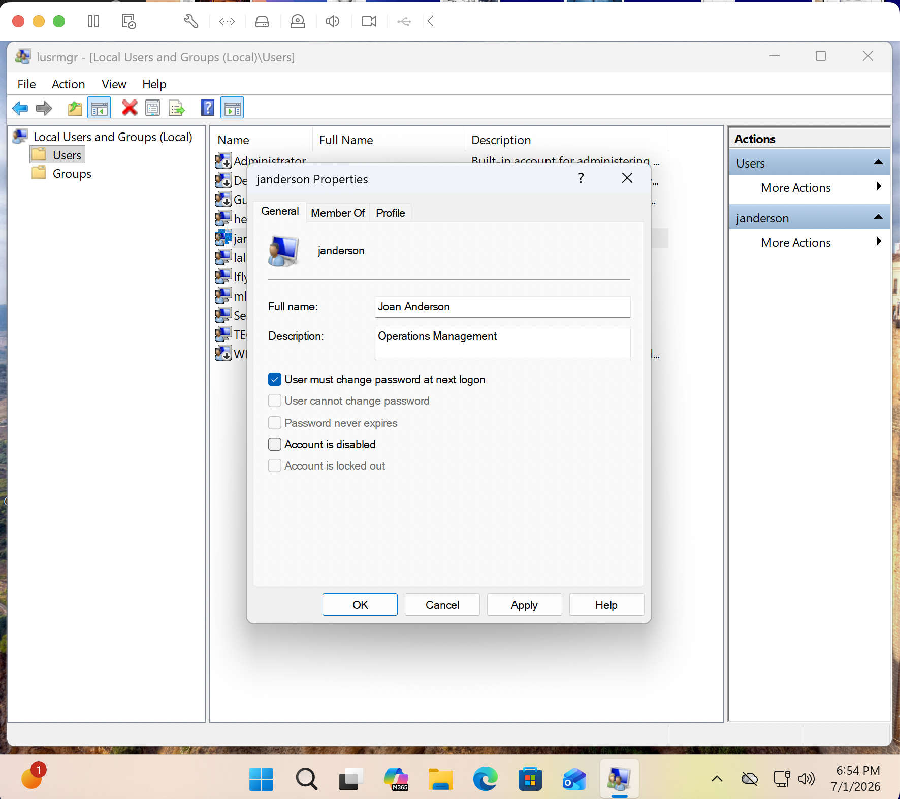
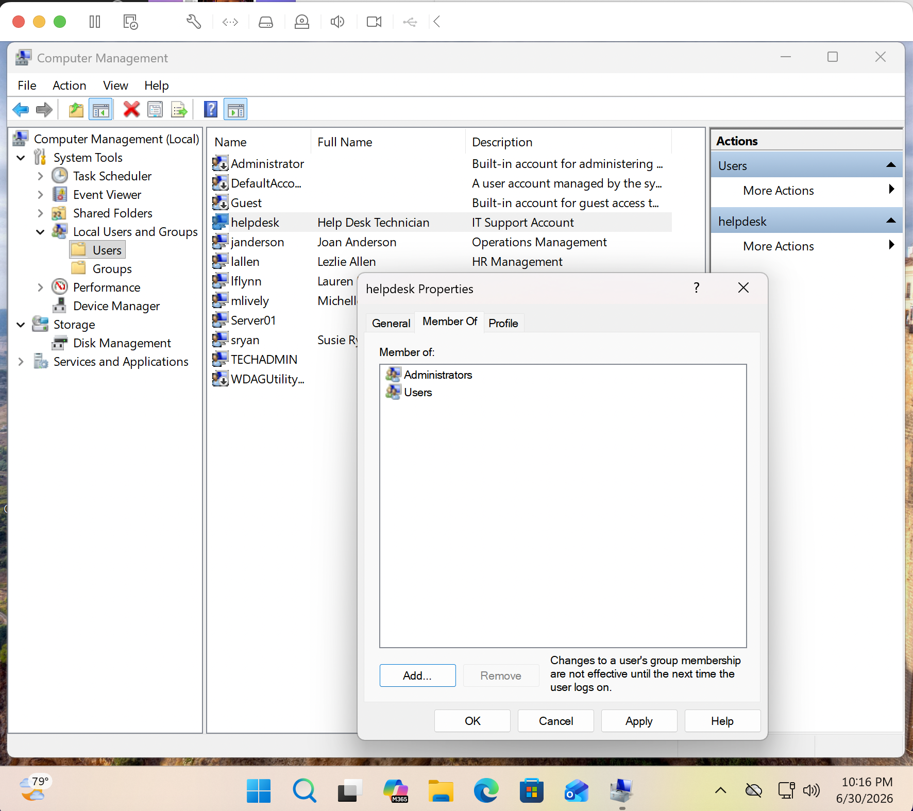
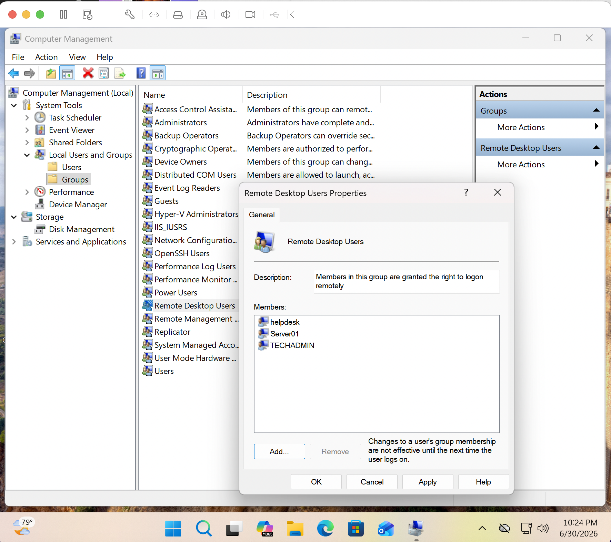

# Creating Local Users on Windows 11 Workstation

## Business Scenario

A small-to-medium business requires controlled access to employee workstations based on job responsibilities. This project simulates the process of creating and managing local Windows user accounts before integration with centralized Active Directory management.

The goal is to demonstrate how IT Support teams provision user accounts, assign appropriate permissions, and configure remote access while following the principle of least privilege.

---

## Project Objective

Create and manage local user accounts on a Windows 11 Pro ARM client workstation. This includes creating standard employee accounts, configuring administrative access for IT support accounts, and assigning Remote Desktop Users permissions for approved remote access.

---

## Skills Demonstrated

- Windows local user account management
- Local Users and Groups administration
- User permission assignment
- Administrator group management
- Remote Desktop configuration
- Principle of least privilege
- Windows endpoint administration
- Help Desk user support procedures

---

## Screenshots

> 

> 

> 

---

|Component|Details|
|---|---|
|Host|MacBook Air M2 (8GB RAM)|
|Hypervisor|VMware Fusion|
|Client|Windows 11 Pro ARM|
|Server|Windows Server 2022 Datacenter (LABDC01)|
|Cloud|Microsoft Azure Student Subscription|
|Tools|Computer Management, Windows Settings, Local Users and Groups|

## Project Architecture

> Insert diagram here.

MacBook Air M2  
↓  
VMware Fusion  
↓  
Windows 11 Pro ARM Client Workstation  
↓  
Local User Accounts and Permissions  
↓  
Future Integration with Active Directory Domain (LABDC01)

---

## Implementation Summary

### Phase 1

Configured local user management on the Windows 11 Pro ARM client workstation.

- Accessed Computer Management.
- Navigated to:
  - System Tools
  - Local Users and Groups
  - Users
- Reviewed existing local accounts and prepared the workstation for employee account creation.

### Phase 2

Created and configured local user accounts.

- Created standard employee user accounts.
- Added user information including:
  - Username
  - Full name
  - Description
  - Password settings
- Configured employee accounts as standard users without administrator privileges.
- Created an IT support account with elevated administrative permissions.

### Phase 3

Configured remote administration access.

- Added approved IT users to the Remote Desktop Users group.
- Verified Remote Desktop permissions were assigned correctly.
- Tested user sign-in and permission behavior.

This setup simulates how IT departments separate standard employee access from administrative support accounts to reduce security risks.

---

## Validation

- Confirmed new user accounts appear under Local Users and Groups.
- Verified standard users do not have unnecessary administrative privileges.
- Confirmed IT support accounts are members of the Administrators group.
- Verified Remote Desktop Users group contains approved accounts.
- Tested user login functionality.
- Confirmed permissions match the assigned user roles.

---

## Challenges Encountered

- Ensuring users received only the required permissions based on their role.
- Understanding the difference between standard users, administrators, and Remote Desktop Users.
- Verifying permission changes required users to sign out and back in before taking effect.

---

## Future Improvements

- Replace local user management with centralized Active Directory user management.
- Create department-based Organizational Units and security groups.
- Implement Group Policy-based user configuration.
- Manage user permissions through Active Directory security groups.
- Automate user creation using PowerShell.

---
