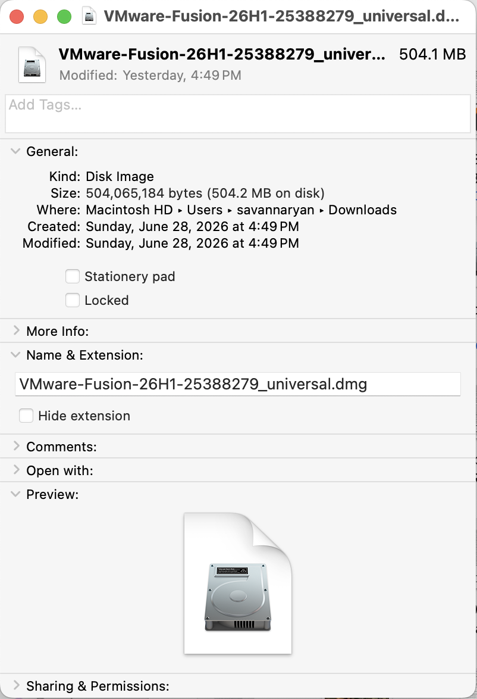
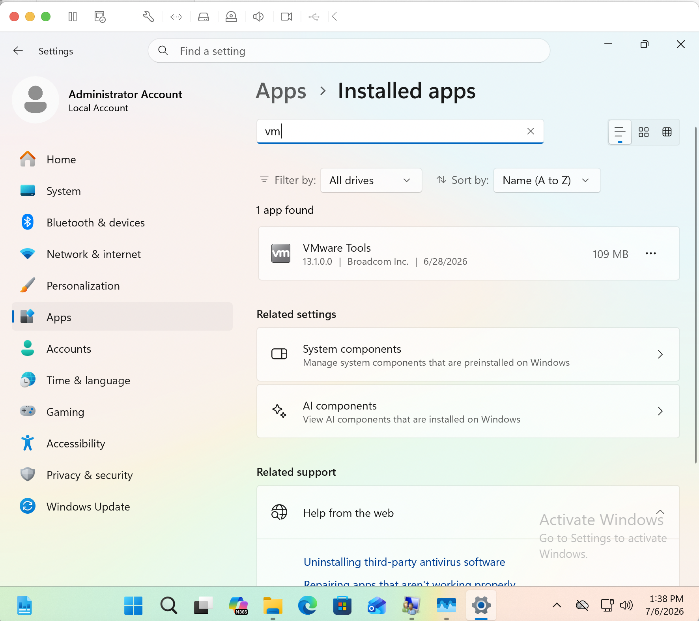

# VMware Fusion Infrastructure Setup

## Business Scenario

> Before deploying enterprise services such as Active Directory, Group Policy, and Windows Server, an organization must first establish a reliable virtualization platform for testing and development. This project focuses on preparing the local virtualization environment by installing VMware Fusion, deploying a Windows 11 Pro ARM virtual machine, installing VMware Tools, and configuring virtual networking. This environment serves as the client workstation for future enterprise infrastructure projects.

---

## Project Objective

> Build a stable virtualization environment on a MacBook Air using VMware Fusion to host a Windows 11 Pro ARM virtual machine. The project establishes the foundation for future Windows Server, Active Directory, networking, and enterprise administration labs while providing hands-on experience with virtualization, virtual networking, and Windows client configuration.

---

## Skills Demonstrated

- VMware Fusion Installation and Configuration
    
- Virtual Machine Deployment
    
- Windows 11 Pro ARM Administration
    
- VMware Tools Installation
    
- Virtual Networking Concepts (NAT, Bridged, Host-Only)
    
- Windows Network Configuration
    
- Network Connectivity Verification
    
- Basic Windows Troubleshooting
    
- Virtual Infrastructure Documentation
    
- Enterprise Lab Planning
    

---

## Screenshots

> 

> 

---

|Component|Details|
|---|---|
|Host|MacBook Air (M2, 8 GB RAM)|
|Hypervisor|VMware Fusion|
|Client|Windows 11 Pro ARM|
|Server|None (Implemented in later project phases)|
|Cloud|None|

## Project Architecture

> - macOS Host
>     
> - VMware Fusion Hypervisor
>     
> - Windows 11 Pro ARM Virtual Machine
>     
> - Virtual Network Adapter
>     
> - Internet Connectivity  

---

## Implementation Summary

### Phase 1 – VMware Fusion Installation

- Installed VMware Fusion on the macOS host.
    
- Verified successful installation and application functionality.
    
- Reviewed virtualization settings and virtual machine storage configuration.
    

### Phase 2 – VMware Tools Installation

- Installed VMware Tools within the Windows 11 virtual machine.
    
- Enabled optimized virtual hardware drivers.
    
- Verified VMware services were running correctly.
    
- Confirmed enhanced VM integration, including improved display and input support.
    

### Phase 3 – Virtual Network Configuration

- Configured the virtual machine network adapter.
    
- Reviewed NAT, Bridged, and Host-Only networking modes.
    
- Verified IP address assignment and DNS functionality.
    
- Confirmed internet connectivity from the Windows virtual machine.
    
- Documented the final networking configuration for future infrastructure deployment.
    

---

## Validation

- VMware Fusion installed and functioning correctly.
    
- Windows 11 Pro ARM virtual machine deployed successfully.
    
- VMware Tools installed and operational.
    
- Virtual network adapter configured and connected.
    
- Windows received a valid IP configuration.
    
- Internet connectivity and DNS resolution verified.
    
- Virtual environment prepared for future Windows Server deployment.
    

---

## Challenges Encountered

- Understanding the differences between VMware networking modes and selecting the most appropriate configuration for future enterprise services.
    
- Ensuring VMware Tools installed correctly to provide full hardware integration and improved virtual machine performance.
    
- Verifying network connectivity and Windows networking configuration before introducing additional infrastructure components.
    

---

## Future Improvements

- Deploy Windows Server as a Domain Controller.
    
- Expand the virtual infrastructure with additional Windows servers.
    
- Integrate Microsoft Azure resources into the lab.
    
- Implement Active Directory Domain Services (AD DS).
    
- Configure DNS, Group Policy, and enterprise file services.
    

---

## Related Documentation

- VMware Fusion Installation
    
- VMware Tools Installation
    
- VMware Virtual Network Configuration
